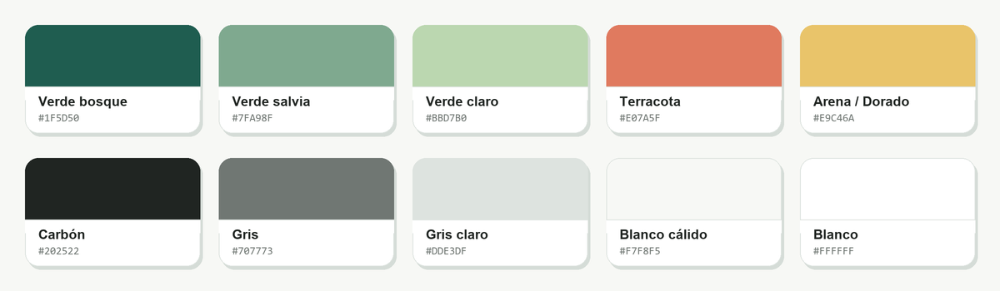
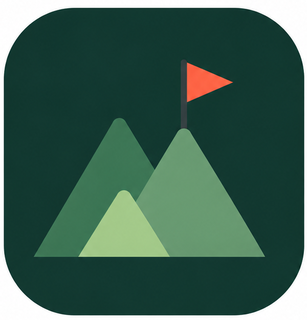

# 🌎 WaySpot

### Descubre lugares. Comparte experiencias. Encuentra tu próximo spot.

**Aplicación móvil para descubrir, reseñar y compartir lugares turísticos y spots especiales.**

---

## Sobre WaySpot

**WaySpot** es una aplicación móvil diseñada para crear una comunidad alrededor del descubrimiento de lugares turísticos y spots especiales.

Los usuarios podrán explorar nuevos lugares, compartir sus experiencias mediante **reseñas y calificaciones**, interactuar con las opiniones de otros usuarios y seguir cuentas para descubrir nuevas recomendaciones.

> **Nuestra idea:** facilitar el descubrimiento de nuevos lugares a través de las experiencias reales de la comunidad.

---

## Funcionalidades principales

* Explorar lugares turísticos y spots especiales.
* Calificar lugares.
* Publicar reseñas y comentarios.
* Interactuar con las reseñas de otros usuarios.
* Seguir a otros usuarios.
* Recibir notificaciones sobre interacciones.
* Consultar un feed con opiniones y recomendaciones.

---

## Tecnologías

| Tecnología          | Uso                                 |
| ------------------- | ----------------------------------- |
| **Kotlin**          | Desarrollo de la aplicación Android |
| **Android Studio**  | Entorno de desarrollo               |
| **Git & GitHub**    | Control de versiones y colaboración |
| **GitHub Projects** | Gestión de Issues y Sprints         |

---

## Identidad visual

### Paleta de colores

Los colores de WaySpot combinan naturaleza, calidez y contraste para crear una experiencia cercana y fácil de reconocer.

### Iconos de la app

| Versión clara | Versión oscura |
|:---:|:---:|
|  |  |

---

## Diseño en Figma

Las pantallas de WaySpot fueron diseñadas previamente en Figma para definir la interfaz y experiencia de usuario de la aplicación.

[Ver diseño de WaySpot en Figma](https://www.figma.com/make/RBOjIUcUe0htgqXmQTybX8/ReviewHub-mobile-app-design?code-node-id=0-6&p=f&t=n2XtAjCNciJ0qnT3-0&fullscreen=1)

---

## Documentación

* [Requisitos funcionales](./doc/Requisitos%20Funcionales.pdf)
* [Diagrama de base de datos](doc/diagrams/Diagrama%20de%20BD.png)
* [Diagrama de clases](doc/diagrams/Diagrama%20de%20clases%20-%20WaySpot.jpeg)

---

### WaySpot

**Descubre · Comparte · Explora**

