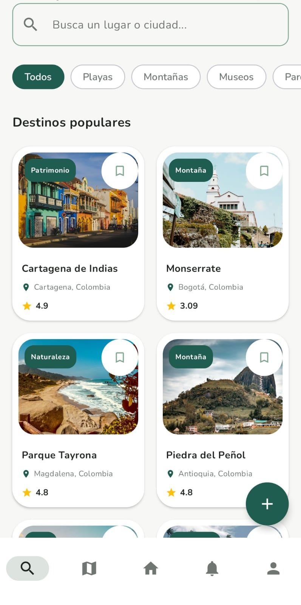

**Discover places. Share experiences. Find your next favorite spot.**

[English](./README.md) | [Español](./README.es.md)

## Promotional video

https://github.com/user-attachments/assets/51c5f168-5138-4f3f-b2d4-b18493d73697

---

## About WaySpot

WaySpot is an Android app designed to bring people together around discovering tourist destinations and special places. Users can explore places, share experiences through reviews and ratings, interact with community recommendations, and follow other travelers.

### Our value proposition

WaySpot helps travelers discover, rate, and share places through authentic community reviews. These experiences help people find destinations, make more informed travel plans, and connect with others who enjoy exploring.

---

## Main features

- Explore tourist destinations and special places by category.
- Find places on an interactive map.
- Publish reviews, ratings, and photos.
- Interact with reviews and follow other users.
- Save places for later.
- Browse a community feed and receive activity notifications.

---

## Selected app mockups

These mockups show the current interface in Spanish.

### Explore and map

  
  
  

### Place details

  
  

---

## Technologies

- Kotlin and Android
- Jetpack Compose and Material 3
- Firebase Authentication, Firestore, Cloud Functions, Storage, Analytics, Cloud Messaging, and Crashlytics
- MapLibre for maps
- Retrofit for REST API communication
- Hilt for dependency injection
- Git, GitHub, and Android Studio

---

## Technical overview: the `data` layer

The `data` package connects the app to its remote services and turns their responses into models the rest of the app can use:

1. A ViewModel requests information through a repository, such as `PlaceRepository`.
2. The repository calls a data source through an interface. Hilt connects these interfaces to their implementations in `DataSourceModule`.
3. The data sources read or write remote services. Places and user/review data use Cloud Firestore; nearby-place recommendations use a Firebase callable function. Retrofit services are also present for REST endpoints.
4. Remote payloads are represented by DTOs and mapped into app models. Repositories return `Result` values, including failures, to the calling layer.

The package is organized into `datasource` (service access), `dto` (wire formats), `mapper` (conversions), `model` (app-facing data), `repository` (coordination and error handling), and `injection` (Hilt bindings). `data/local/PreviewData.kt` and `PreviewDataPopular.kt` provide preview sample content; they are not a local persistence database.

---

## Visual identity

WaySpot's palette combines nature-inspired greens, warmth, and contrast to create a recognizable and welcoming visual identity.

  

---

## Project team

| Team member | Role |
| --- | --- |
| Andrés Cortés | Technical Project Manager and Developer |
| Santiago Bautista Velásquez | Scrum Master and Developer |
| Iván Fuenmayor | Software Developer |
| Andrés Rodríguez Díaz | Software Developer |

